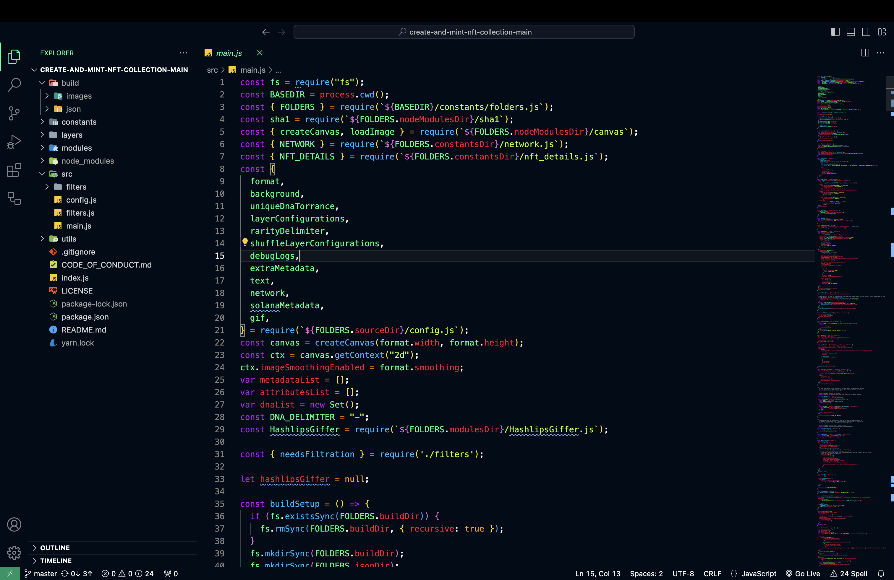

# Cool Night Theme for VS Code
 
## Easy Installation

1.  Open the extensions sidebar on Visual Studio Code
2.  Search for  **Cool Night**
3.  Click  **Install**  to install it.
4.  Click  **Reload**  to reload your editor.
5.  Code/File ＞ Preferences ＞ Color Theme ＞  **Andromeda**.
6.  🌟 Enjoy and  [Rate five-stars](https://marketplace.visualstudio.com/items?itemName=sam-thisha.cool-night&ssr=false#review-details "https://marketplace.visualstudio.com/items?itemName=sam-thisha.cool-night&ssr=false#review-details").

## License
[MIT](https://github.com/sam-thisha/cool-night/blob/main/LICENSE "https://github.com/sam-thisha/cool-night/blob/main/LICENSE")
